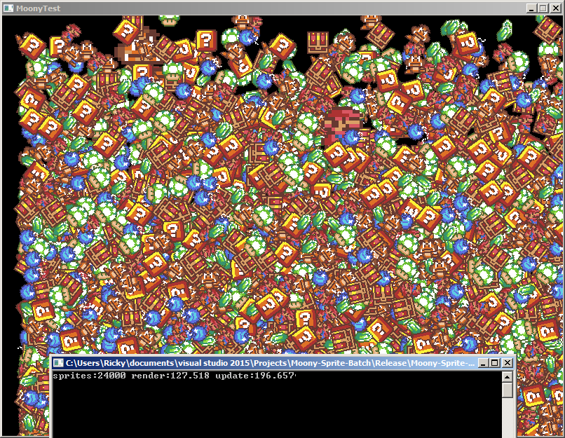

# Moony-SpriteBatch
Drawing thousands of dynamic z-ordered sprites with SFML


## Introduction
Moony-SpriteBatch allows C++ developers that use SFML to draw many more sprites without worrying about performance limitations. This is significant because applications using SFML begin to slow down when drawing a couple thousand sprites. You can use Moony-SpriteBatch for drawing very large tilemaps, making a bullet hell game or a particle simulator. Moony-SpriteBatch also supports dynamic sprites and z-ordering. This library works directly with Moony-TexturePacker by rendering sprites that use the same texture and can even load .mtpf files produced by the TexturePacker.

## How to build
The library is header only so there really isn't anything to build if you want to just jump straight in and use it. You only need to include `TextureAtlas.h`, `SpriteBatch.h` and `Log.h` if you want to use it for logging info. If you are going to be loading zlib compressed texture pack files then define `USE_ZLIB` in your source somewhere and link zlib to your application.

I provided an Example.cpp that showcases what Moony-SpriteBatch can do. To build the example program on Windows with Visual Studio open a `Developer Command Prompt` and enter this:

Change your directory to the source directory
>cd C:/path/to/source

Compile and link the source code
>cl /I C:/path/to/SFML/include C:/path/to/SFML/lib/sfml-system.lib C:/path/to/SFML/lib/sfml-window.lib C:/path/to/SFML/lib/sfml-graphics.lib Example.cpp

The code should compile and produce Example.exe.

If you want to build with zlib feature do this:
>cl /D USE_ZLIB /I C:/path/to/SFML/include /I C:/path/to/zlib/include C:/path/to/SFML/lib/sfml-system.lib C:/path/to/SFML/lib/sfml-window.lib C:/path/to/SFML/lib/sfml-graphics.lib C:/path/to/zlib/lib/zlib.lib Example.cpp

You can also change out the names with debug versions of the libraries if you'd like. Remember that you must put `sfml-system-2.dll`, `sfml-window-2.dll`, `sfml-graphics-2.dll` and `zlib.dll` with the executable in order for it to run. If you want to link statically it's essentially the same thing but using the `/MT` flag, though I haven't tried it..


If you are using GCC or MinGW open a `Command Prompt` or `Terminal` and enter this:

Change your directory to the source directory
>cd C:/path/to/source

Compile and link the source code
>g++ Example.cpp -I C:/path/to/SFML/include -L C:/path/to/SFML/lib -lsfml-graphics -lsfml-window -lsfml-system -s -O2 -o Example.exe

And if you want to build with zlib:
>g++ Example.cpp -D USE_ZLIB -I C:/path/to/SFML/include -I C:/path/to/zlib/include -L C:/path/to/SFML/lib -lsfml-graphics -lsfml-window -lsfml-system -L C:/path/to/zlib/lib -lzlib -s -O2 -o Example.exe

__Note!__ I don't know if this needs saying but use your own directories. C:/path/to/SFML is not a real directory, just an example. Just in case..

## How to use
The library is designed to be a drop in solution if you are using SFML. Grab the header files and put them where your project can see them and that's it. Now you have to include `TextureAtlas.h` to load .mtpf files. Loading the files work very similarly to loading resources in other SFML classes.
```cpp
moony::TextureAtlas texture_atlas;
...
if(!texture_atlas.loadFromFile("path/to/texture/texture.mtpf");
```

Now that the `moony::TextureAtlas` object has deserialized our texture.mtpf file we need to create a `moony::SpriteBatch` object so that we can actually draw our sprites later on. Don't forget to include `SpriteBatch.h`!
```cpp
...
moony::SpriteBatch sprite_batch;
```

Okay let's make our `moony::Sprite` object and set its texture and layer.
```cpp
...
moony::Sprite player1;
player1.m_subtexture = texture_atlas.findSubTexture("mario.png");
player1.m_layer = 1;
```

As you can see getting your textures out of the `moony::TextureAtlas` object is super simple. The `findSubTexture();` function returns a `moony::Texture` object that has a pointer to the underlying `sf::Texture` and the `sf::IntRect` which defines the bounds of the texture we requested. The reason I designed the system like this is so that you can use the textures with `moony::Sprite` or `sf::Sprite` by using the `setTexture()` and `setTextureRect()` functions.

Now on to the drawing. To draw your `moony::Sprite` objects you just need to pass it to `moony::SpriteBatch` in your render loop.
```cpp
window.clear();

sprite_batch.clear();
sprite_batch.draw(player1);
...
sprite_batch.order();

window.draw(sprite_batch);
```

The `moony::SpriteBatch` has an API very similar to SFML's own `sf::RenderTarget` class. The sprite batch holds all the vertices of every sprite you have drawn and needs to be cleared or you will push extra vertices onto it's list. I do plan on coding a fool-proof way of doing this so you can't memory leak even if you tried but if you just remember to call `moony::SpriteBatch::clear()` before drawing your sprites you should be fine. The order function just arranges the sprites in order according to layer and texture. Finally, the sprite batch object is itself a `sf::Drawable` and can be drawn just like a `sf::Sprite`.

##FAQ
__Can `moony::SpriteBatch` draw `sf::Sprite` objects?__ No.

##To do
Create a switch so that after every call to order() you are required to call clear() so that you don't overdraw and cause the internal array to grow without bounds.
